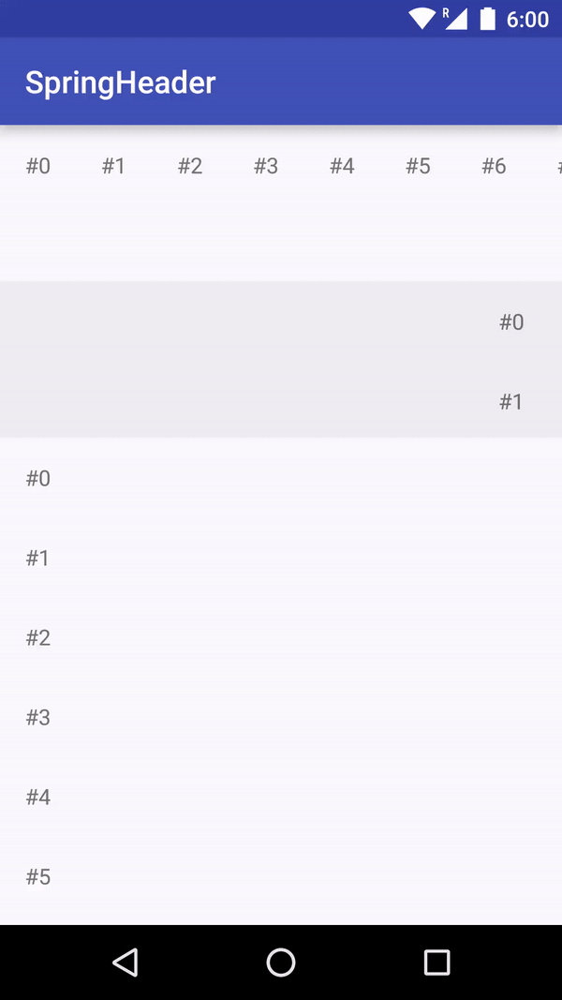

SpringHeader
========

An implementation of spring-like header (known as pull-to-refresh) that using `CoordinatorLayout`.



Usage
--------

### Simple Way

Just put a `com.loopeer.springheader.SimpleRefreshHeader` in your `CoordinatorLayout`,
and add the attribute `app:layout_behavior="@string/dependent_view_behavior"` in the scroll view to let it scroll along header.

```xml
<android.support.design.widget.CoordinatorLayout
    xmlns:android="http://schemas.android.com/apk/res/android"
    xmlns:tools="http://schemas.android.com/tools"
    xmlns:app="http://schemas.android.com/apk/res-auto"
    android:layout_width="match_parent"
    android:layout_height="match_parent"
    tools:context=".SpringHeaderActivity">

    <com.loopeer.springheader.SimpleRefreshHeader
        android:id="@+id/header"
        android:layout_width="match_parent"
        android:layout_height="48dp"
        android:background="#cccccc"/>

    <include
        layout="@layout/scroll_view"
        android:layout_width="match_parent"
        android:layout_height="match_parent"
        app:layout_behavior="@string/dependent_view_behavior"/>

</android.support.design.widget.CoordinatorLayout>
```

#### Note:

You can use `DependentViewBehavior` on other views as well, and you can use it multiple times or not use it at all.

The reason why we don't use `CoordinatorLayout.Behavior`'s layout dependency function is that it won't meet all our needs.

#### Simple Customization

`SimpleRefreshHeader` has three attributes `textBelowThreshold`, `textAboveThreshold` and `textRefreshing`.
You can also set color scheme via java code.

`SimpleRefreshHeader` has a `DefaultBehavior`, the `SpringHeaderBehavior`.
And `SpringHeaderBehavior` has three params `behavior_originalOffset`, `behavior_hoveringRange` and `behavior_maxRange`:
* `behavior_originalOffset` is the original offset of header;
* `behavior_hoveringRange` is the range from original offset to hovering offset;
* `behavior_maxRange` is the range from original offset to max offset.
`SimpleRefreshHeader` has a default behavior set, but if you set any of above attributes,
you may also add attribute `app:layout_behavior="@string/spring_header_behavior"` to make it work.

### Extended Way

`com.loopeer.springheader.RefreshHeader` is the base class for implementing your own style of refresh header.

Also you can make use of any `View`s to make it work,
just hook it up through the `SpringHeaderCallback` sets on `SpringHeaderBehavior`:

```java
public interface SpringHeaderCallback {
    void onScroll(int offset, float fraction);

    void onStateChanged(int newState);
}
```

`onScroll()` method is called whenever the header offset changed.
* `fraction = (currentOffset - originalOffset) / hoveringRange`.
`fraction` starts from 0, and when `currentOffset` equals `hoveringOffset`, `fraction` equals `1`.

`onStateChanged()` method is called whenever the header state changed.
There are four states `STATE_COLLAPSED`, `STATE_HOVERING`, `STATE_DRAGGING` and `STATE_SETTLING`.

`RefreshHeader` implements `SpringHeaderCallback`.

References
========

This project is mainly referencing `Android Support Library`,
including `Design Support Library` and `v4 Support Library`.
There are three class `ViewOffsetBehavior`, `ViewOffsetHelper` and `MaterialProgressDrawable`
copied from the `Android Support Library`.

License
========

[Apache License Version 2.0](LICENSE)
